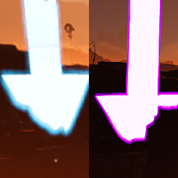

# hd2-sc-arrow

Helldivers 2 mod that puts arrows above Super Credit piles.

## How do I see the arrows from afar?
You have to do the following:
1. Press `Win+R`
2. Go to `%appdata%/Arrowhead/Helldivers2`
3. Open `user_settings.config` with your favourite text editor
4. Search for `lod_selection_multiplier` variable and set it to `10.5`
5. Save the file
6. Right click `user_settings.config`, go to `Properties` and enable the **Read-only** attribute.  
Otherwise, the game will reset the variable to a lower value.

> [!WARNING]  
> **Doing this will tank your FPS.**  
> So after you're done farming you should revert the `lod_selection_multiplier` back to stock.  
> Or disable the `Read-only` attribute from the `user_settings.config` file.
